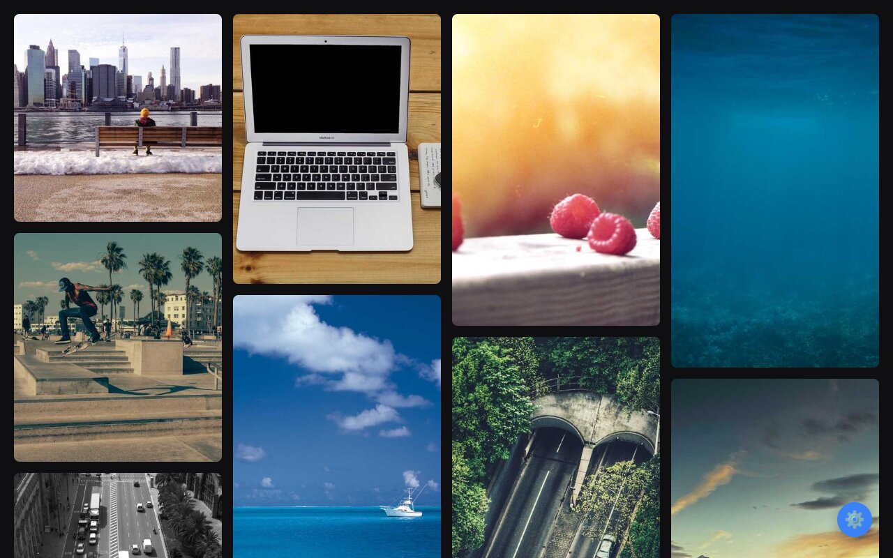

# Dynamic Gallery Designer

Paste a list of image URLs and get an instant gallery: automatic masonry layout for larger sets, centered flex for small ones, plus five color themes, gap/radius controls, and a lightbox viewer. All client-side.

**Live:** https://mvvk-space.github.io/gallery-app/

